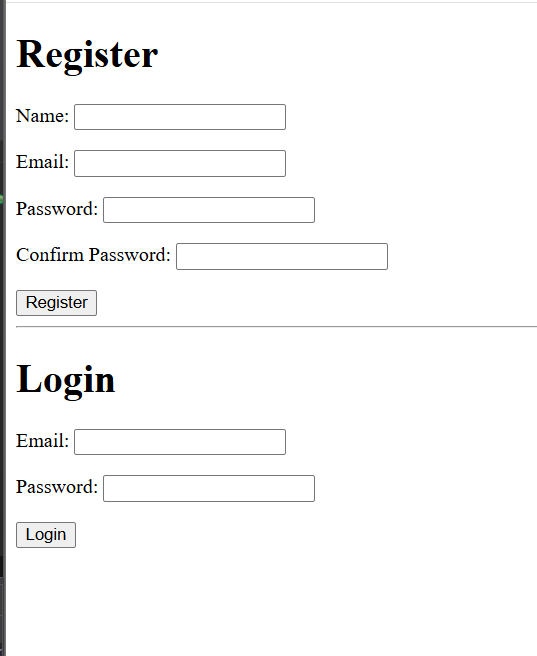

# Login & Registration System

A secure **Login and Registration System** built with **Java Spring Boot**, **Spring MVC**, **Spring Data JPA**, **JSP**, **MySQL**, and **BCrypt** password encryption. This project demonstrates user authentication, form validation, session management, and database integration following the MVC architecture.

---

# Features

* User Registration
* User Login
* Password Encryption using BCrypt
* Form Validation
* Email Validation
* Password Confirmation Validation
* Session-Based Authentication
* Logout Functionality
* Error Messages
* MySQL Database Integration
* MVC Architecture

---

# Technologies Used

* Java 17
* Spring Boot
* Spring MVC
* Spring Data JPA
* Hibernate
* MySQL
* JSP
* JSTL
* Maven
* BCrypt
* HTML5
* CSS3

---

# Project Structure

```
src
│
├── controllers
│      HomeController.java
│
├── models
│      User.java
│      LoginUser.java
│
├── repositories
│      UserRepository.java
│
├── services
│      UserService.java
│
├── validator
│      UserValidator.java
│
└── webapp
       └── WEB-INF
              loginReg.jsp
              dashboard.jsp
```

---

# Application Workflow

## Registration

1. User enters:

   * Name
   * Email
   * Password
   * Confirm Password

2. Spring Validation checks:

* Required fields
* Email format
* Password length
* Password confirmation

3. If validation succeeds:

* Password is encrypted using BCrypt.
* User information is saved in MySQL.
* User session is created.
* User is redirected to the Dashboard.

---

## Login

1. User enters Email and Password.

2. System checks:

* Email exists
* Password matches the encrypted password

3. If credentials are correct:

* User session starts.
* Dashboard is displayed.

Otherwise:

* Error message appears.

---

## Dashboard

After successful login or registration, the user is redirected to the dashboard where a welcome message is displayed along with a logout option.

---

# Validation

This project uses **Jakarta Validation** annotations.

Examples include:

* `@NotBlank`
* `@Email`
* `@Size`
* Custom Password Confirmation Validation

---

# Security

Passwords are **never stored as plain text**.

The application uses:

* BCryptPasswordEncoder

to hash passwords before saving them into the database.

---

# Database

Example User Table

| Column     | Type     |
| ---------- | -------- |
| id         | BIGINT   |
| name       | VARCHAR  |
| email      | VARCHAR  |
| password   | VARCHAR  |
| created_at | DATETIME |
| updated_at | DATETIME |

---

# Screenshots

## Login & Registration Page



The home page contains two forms:

* Register Form
* Login Form

Users can create a new account or sign in using existing credentials.

---

## Dashboard

.png)

After successful authentication, the user is redirected to the dashboard where they are welcomed by name and can securely log out of the application.

---

# What I Learned

During this project I learned how to:

* Build a complete authentication system using Spring Boot.
* Apply the MVC architecture.
* Connect Spring Boot with a MySQL database.
* Use Spring Data JPA for database operations.
* Perform server-side form validation.
* Create custom validation logic.
* Encrypt passwords using BCrypt.
* Manage user sessions.
* Handle login and logout functionality.
* Display validation and authentication error messages in JSP.
* Use `@ModelAttribute`, `@Valid`, and `BindingResult`.
* Work with JSP and JSTL to create dynamic web pages.

---
# Screenshot

## Login & Registration System


The application provides a complete authentication system where users can create a new account or log in with existing credentials. The registration form validates user input, encrypts passwords using BCrypt before storing them in the database, and automatically redirects users to the dashboard after successful authentication. Existing users can securely log in using their email and password.

# Future Improvements

* Forgot Password
* Email Verification
* Remember Me functionality
* Spring Security integration
* User Roles (Admin/User)
* Profile Management
* Change Password
* Responsive UI using Bootstrap

---

# Author

**Jalil Wasaya**

Full Stack Developer Student at **AXSOS Academy**

---

# Project Outcome

This project provides a strong foundation for implementing authentication in Java Spring Boot applications. It demonstrates secure password handling, form validation, session management, and database persistence while following clean MVC design principles.
