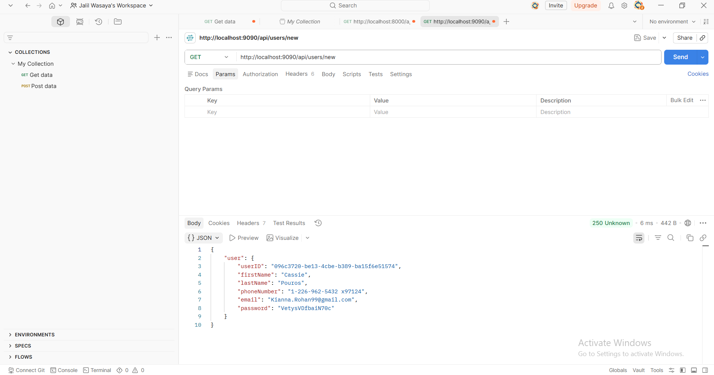
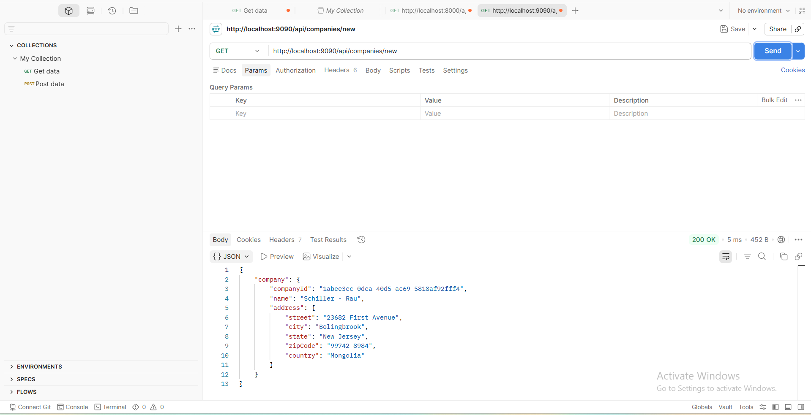
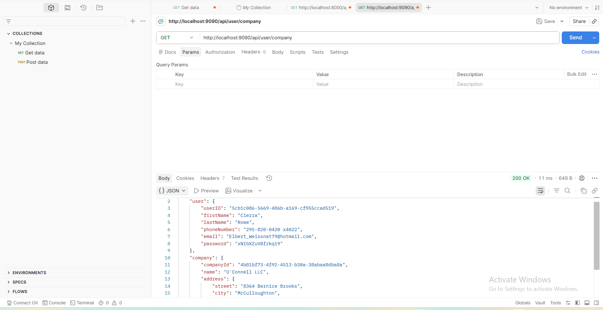

# Faker API

## Description

This project is a simple REST API built with **Node.js**, **Express**, and **Faker**. It generates random **User** and **Company** data every time a request is sent.

The API provides three POST routes:

- Create a new User
- Create a new Company
- Create both a User and a Company

---

## Technologies Used

- Node.js
- Express.js
- Faker (@faker-js/faker)
- Nodemon
- Postman

---

## Installation

### 1. Clone the repository

```bash
git clone <repository-url>
```

### 2. Navigate into the project

```bash
cd Faker_API
```

### 3. Install dependencies

```bash
npm install
```

---

## Run the Server

Using Nodemon:

```bash
npm run dev
```

or using Node:

```bash
node server.js
```

The server will run on:

```
http://localhost:9090
```

---

## API Endpoints

### Create a New User

**POST**

```
http://localhost:9090/api/users/new
```

Response Example:

```json
{
    "user": {
        "_id": "...",
        "firstName": "John",
        "lastName": "Smith",
        "phoneNumber": "555-123-4567",
        "email": "john@example.com",
        "password": "password123"
    }
}
```

---

### Create a New Company

**POST**

```
http://localhost:9090/api/companies/new
```

Response Example:

```json
{
    "company": {
        "_id": "...",
        "name": "ABC Company",
        "address": {
            "street": "123 Main St",
            "city": "New York",
            "state": "NY",
            "zipCode": "10001",
            "country": "United States"
        }
    }
}
```

---

### Create User and Company

**POST**

```
http://localhost:9090/api/user/company
```

Response Example:

```json
{
    "user": { ... },
    "company": { ... }
}
```

---

## Testing

Open **Postman** and create three **POST** requests.

No request body is required.

---

## Screenshots

### User Endpoint



---

### Company Endpoint



---

### User & Company Endpoint



---

## Project Structure

```
Faker_API
│
├── node_modules
├── package.json
├── package-lock.json
├── server.js
├── README.md
├── user.png
├── company.png
└── both.png
```

---

## Author

Jalil Wasaya