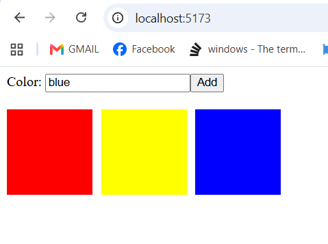

# Box Generator

A simple React application that allows users to enter a color and create colored boxes.

## Features

* Enter a color such as red, blue, green, or purple.
* Click the Add button to create a new box.
* The new box appears immediately.
* Multiple boxes are displayed next to each other.
* Boxes automatically wrap to the next row when needed.

## Technologies Used

* React
* JavaScript
* HTML
* CSS

## Screenshot



## Run the Project

```bash
npm install
npm run dev
```
