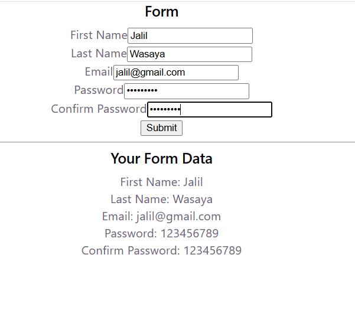

# Hook Form

A simple React form built using the `useState` hook.

The form contains:
- First Name
- Last Name
- Email
- Password
- Confirm Password

The entered data is displayed in real time below the form.

## Display

