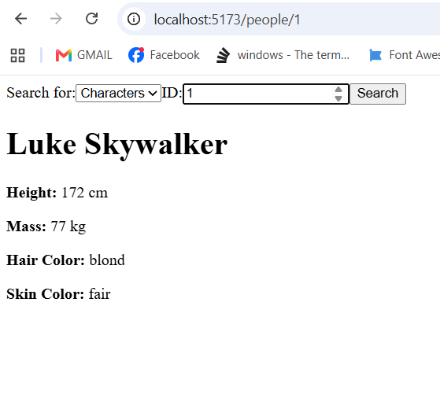
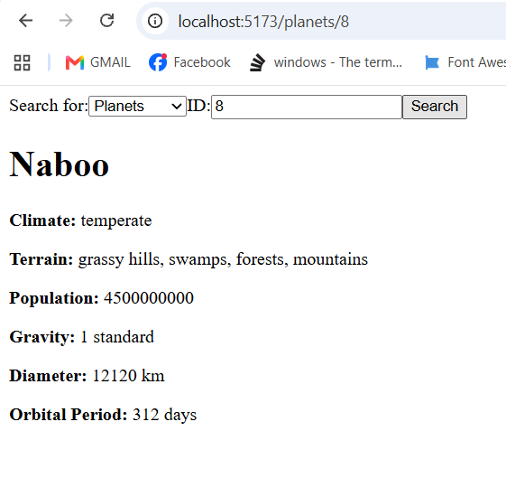
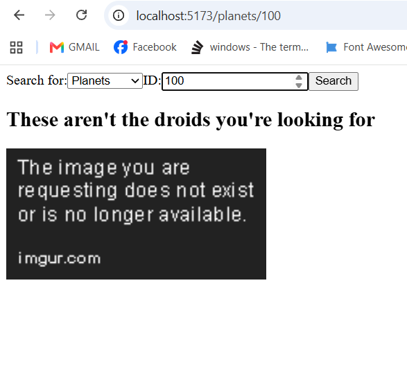

# ⭐ Star Wars Explorer

A React application that allows users to search for **Star Wars Characters** and **Planets** using the Star Wars API.

---

## Features

- Search for Characters (People) or Planets.
- Enter an ID to retrieve information.
- React Router for navigation.
- Axios for API requests.
- Loading state while fetching data.
- Error page with Obi-Wan Kenobi image.
- Displays multiple attributes for each resource.

---

## Technologies Used

- React (Vite)
- React Router DOM
- Axios
- CSS

---

## Installation

1. Clone the repository

```bash
git clone https://github.com/your-username/star-wars-explorer.git
```

2. Install dependencies

```bash
npm install
```

3. Start the project

```bash
npm run dev
```

---

## Project Structure

```
src
│
├── components
│   └── SearchForm.jsx
│
├── pages
│   ├── Home.jsx
│   ├── People.jsx
│   └── Planet.jsx
│
├── App.jsx
└── main.jsx
```

---

# Screenshots

## Character Search

Displays information about a Star Wars character.



---

## Planet Search

Displays information about a Star Wars planet.



---

## Error Page

If the entered ID is invalid, the application displays the following error page.



---

## Example Character Information

- Name
- Height
- Mass
- Hair Color
- Skin Color
- Eye Color
- Birth Year

---

## Example Planet Information

- Name
- Climate
- Terrain
- Population
- Gravity
- Diameter
- Orbital Period

---

## Error Handling

When an invalid ID is entered, the application displays:

> **"These aren't the droids you're looking for."**

along with an image of **Obi-Wan Kenobi**.

---

## Author

**Jalil Wasaya**

AXSOS Academy – Full Stack Development Bootcamp