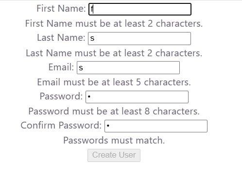

# Hook Form Validation

This project is a React form created using the `useState` hook.

The form allows the user to enter their information and displays validation error messages in real time.

## Features

- First Name validation
- Last Name validation
- Email validation
- Password validation
- Confirm Password validation
- Real-time error messages
- Conditional rendering
- Uses React `useState`
- Error messages do not appear when the inputs are blank

## Validation Rules

- First Name must be at least 2 characters.
- Last Name must be at least 2 characters.
- Email must be at least 5 characters.
- Password must be at least 8 characters.
- Password and Confirm Password must match.

## Technologies Used

- React
- JavaScript
- HTML
- React Hooks (`useState`)

## Screenshot

