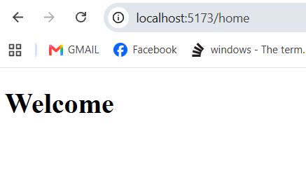
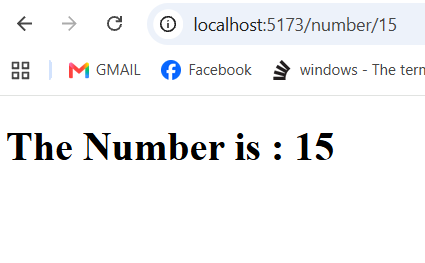
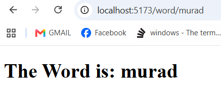
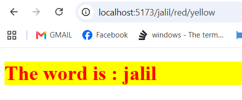

# React Routing Practice

This project is a React application that uses React Router to display different content based on the URL.

## Home Page

Displays a simple Welcome message.

---

## Number Page

Displays a number from the URL.

Example:

`/4`

---

## Word Page

Displays a word from the URL.

Example:

`/hello`

---

## Styled Word Page

Displays a word with a dynamic text color and background color.

Example:

`/hello/blue/red`

- `hello` → Word
- `blue` → Text color
- `red` → Background color

---

## Technologies Used

- React
- React Router DOM
- JavaScript
- HTML
- CSS
- Vite

## Author

Jalil Wasaya